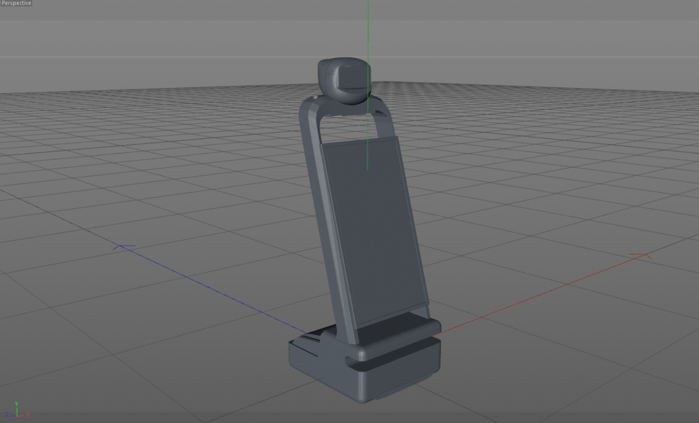
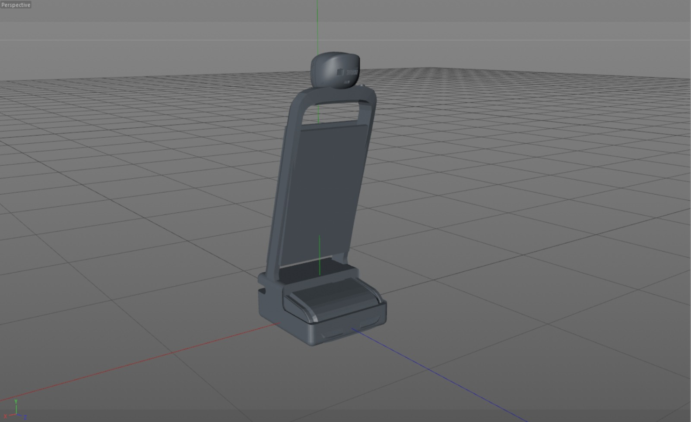

# Mechanical Engineering Task 1 (Collect robot parts)
As you can see in the picture below, we collected the parts of the robot, and a simple thing was modified as you can in the second picture, which is covering the screen from the back to make the shape better.

